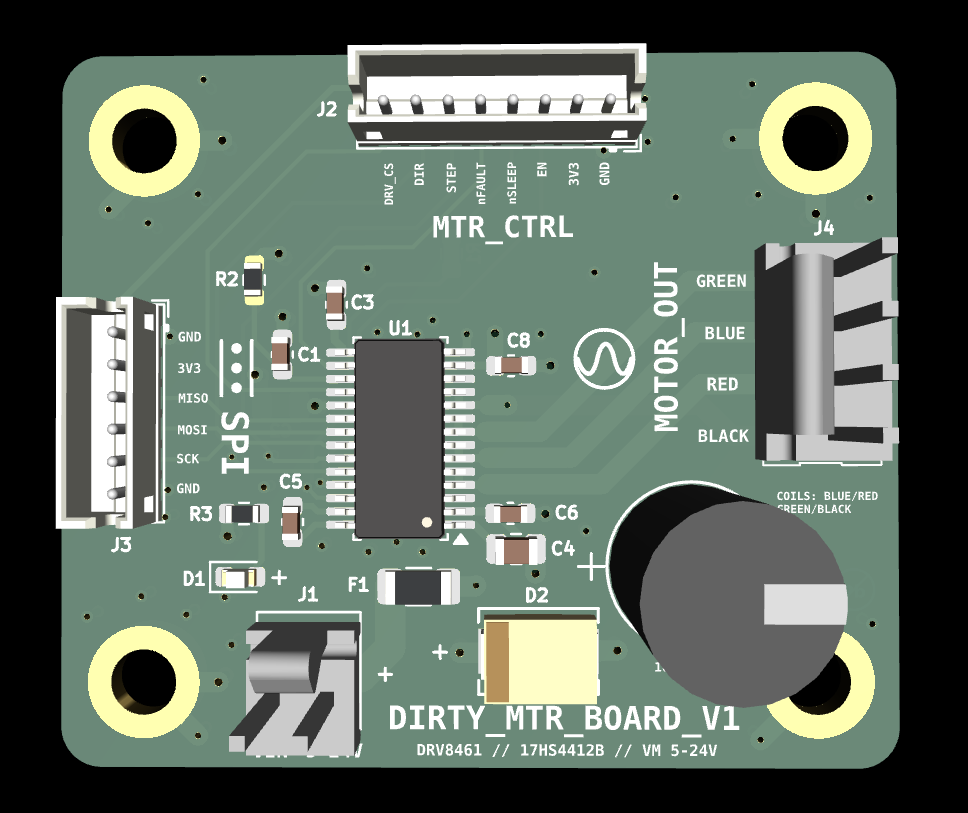
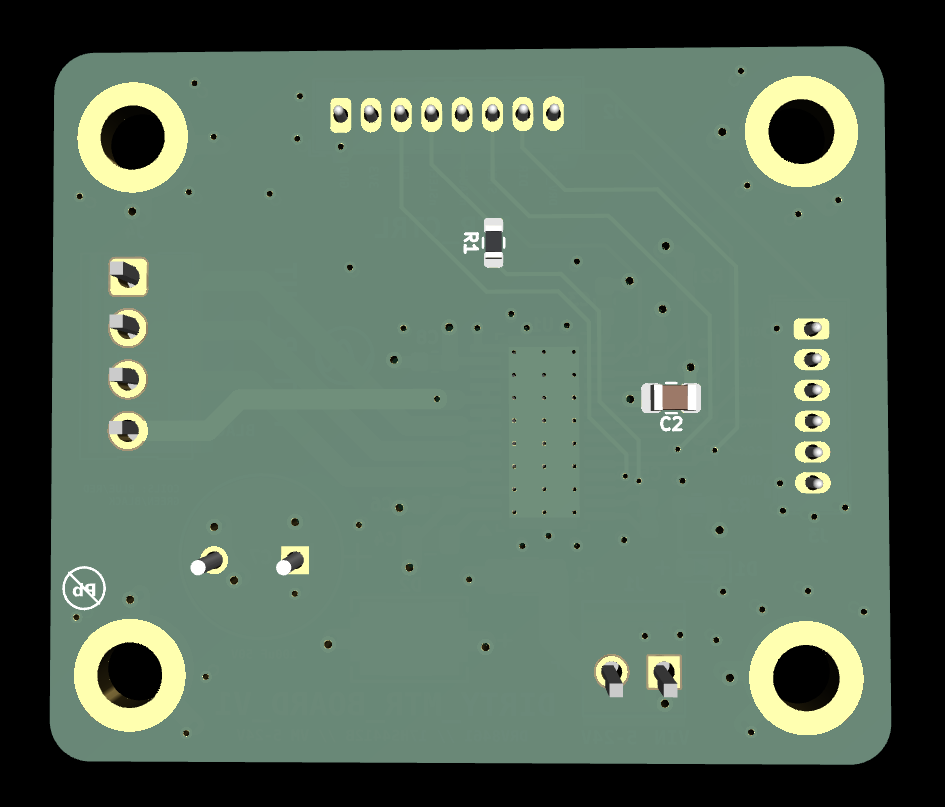

# dirty_motor_board
DRV8461-based stepper motor driver board for Brain_Board, designed for a 17HS4412B NEMA 17 motor with SPI configuration, STEP/DIR control, VM input protection, and chunky motor-output routing.

DRV8461-based stepper motor driver daughter board for Brain_Board.

Dirty_MTR_Board handles the noisy motor-power side of the system: VM input protection, DRV8461 current-regulated stepper drive, motor output routing, and SPI/STEP-DIR control from Brain_Board.

## Overview

This board is designed for a 17HS4412B two-phase stepper motor rated for 3.9 V and 1.2 A/phase. The motor is not powered directly from 3.9 V. Instead, the DRV8461 is supplied from a higher VM rail and regulates coil current internally.

## Key Specs

| Item | Value |
|---|---|
| Driver | TI DRV8461 |
| Motor | 17HS4412B |
| Motor current | 1.2 A/phase |
| VM input | 5-24 V labeled |
| Control | STEP, DIR, EN, nSLEEP, nFAULT |
| Configuration | SPI |
| VM protection | Fuse + SMBJ26A TVS |
| VM bulk cap | 100 µF / 50 V |
| Board role | Motor driver daughter board for Brain_Board |


## Design Notes

- VM is fused and protected with an SMBJ26A TVS diode.
- VM bulk capacitance is provided by a 100 µF / 50 V radial electrolytic capacitor.
- nSLEEP has a 100 kΩ pulldown so the driver defaults to sleep.
- VREF includes a 100 nF capacitor to ground and a DNP 0 Ω option to ground.
- The DRV8461 exposed pad is tied to V-GND with thermal vias.
- Motor output traces are routed wide for 1.2 A/phase operation.

# DIRTY_MOTOR_BOARD

<p align="center">
  
</p>

<p align="center">
  
</p>

DRV8461-based stepper motor driver daughter board for BRAIN_BOARD, designed around a 17HS4412B NEMA 17 stepper motor with SPI configuration, STEP/DIR control, VM input protection, and high-current motor-output routing.

DIRTY_MOTOR_BOARD handles the noisy motor-power side of the system. It keeps motor current, VM protection, driver switching, and chunky output routing off the main controller board.

## Project Status

In progress / prototype hardware repository.

## System Role

```text
BRAIN_BOARD
    ↓ STEP / DIR / EN / nSLEEP / SPI / nFAULT
DIRTY_MOTOR_BOARD
    ↓ current-regulated phase outputs
17HS4412B NEMA 17 stepper motor
```

BRAIN_BOARD provides logic/control signals. DIRTY_MOTOR_BOARD handles VM power input, DRV8461 motor driving, current regulation, and motor connector routing.

## Key Specs

| Item | Value |
|---|---|
| Driver | TI DRV8461 |
| Motor target | 17HS4412B NEMA 17 stepper |
| Motor current | 1.2 A/phase |
| Motor rated voltage | 3.9 V |
| VM input label | 5-24 V |
| Control style | STEP / DIR |
| Configuration | SPI |
| Logic rail | +3.3V from controller side |
| VM protection | Fuse + SMBJ26A TVS |
| VM bulk capacitor | 100 µF / 50 V |
| Board role | Motor driver daughter board for BRAIN_BOARD |

## Important Motor Note

The 17HS4412B motor is rated for **3.9 V and 1.2 A/phase**, but the board does not simply feed the motor 3.9 V.

The DRV8461 is powered from the VM rail and regulates motor coil current internally. The motor voltage rating is not the same thing as the VM supply voltage for a current-regulated stepper driver.

## Main Features

- DRV8461 stepper motor driver
- STEP/DIR control interface
- SPI configuration interface
- EN, nSLEEP, and nFAULT control/status signals
- VM input fuse/protection path
- SMBJ26A TVS diode on VM
- 100 µF / 50 V VM bulk capacitor
- Wide motor-output routing
- Exposed-pad thermal via strategy
- Motor connector matched to measured coil pairs
- Daughter-board connection to BRAIN_BOARD

## Connectors

### J1 - VM Power Input

| Pin | Signal |
|---:|---|
| 1 | GND |
| 2 | VIN / VM |

J1 brings in the motor power supply rail.

```text
VM input → fuse/protection → VM bulk capacitance → DRV8461 VM
```

### J2 - Motor Control

| Pin | Signal |
|---:|---|
| 1 | GND |
| 2 | +3V3 |
| 3 | EN |
| 4 | nSLEEP |
| 5 | nFAULT |
| 6 | STEP |
| 7 | DIR |
| 8 | DRV_CS |

J2 carries the main logic/control signals between BRAIN_BOARD and DIRTY_MOTOR_BOARD.

### J3 - SPI

| Pin | Signal |
|---:|---|
| 1 | GND |
| 2 | +3V3 |
| 3 | SPI_MISO |
| 4 | SPI_MOSI |
| 5 | SPI_SCK |
| 6 | GND |

J3 carries the SPI bus used for DRV8461 configuration/status access.

### M1 - Motor Output

| Pin | Signal |
|---:|---|
| 1 | AOUT2 |
| 2 | BOUT1 |
| 3 | BOUT2 |
| 4 | AOUT1 |

Measured motor coil pairs:

| Coil | Motor connector pins |
|---|---|
| Coil A | pins 1 and 4 |
| Coil B | pins 2 and 3 |

## DRV8461 Control Signals

| Signal | Direction | Purpose |
|---|---|---|
| STEP | Controller → driver | Step pulse input |
| DIR | Controller → driver | Direction input |
| EN | Controller → driver | Driver enable control |
| nSLEEP | Controller → driver | Sleep/wake control |
| nFAULT | Driver → controller | Fault/status output |
| DRV_CS | Controller → driver | SPI chip select |
| SPI_MISO | Driver → controller | SPI data back to controller |
| SPI_MOSI | Controller → driver | SPI data to driver |
| SPI_SCK | Controller → driver | SPI clock |

## Power Architecture

```text
VM input
    ↓
fuse/protection
    ↓
SMBJ26A TVS clamp to GND
    ↓
100 µF / 50 V bulk capacitor
    ↓
DRV8461 VM pins
    ↓
AOUT/BOUT motor phase outputs
```

Logic power comes from the controller side:

```text
BRAIN_BOARD +3.3V → DIRTY_MOTOR_BOARD logic/interface rail
```

## Design Notes

- VM is fused and protected with an SMBJ26A TVS diode.
- VM bulk capacitance is provided by a 100 µF / 50 V radial electrolytic capacitor.
- nSLEEP has a 100 kΩ pulldown so the driver defaults to sleep.
- VREF includes a 100 nF capacitor to ground and a DNP 0 Ω option to ground.
- The DRV8461 exposed pad is tied to V-GND with thermal vias.
- Motor output traces are routed wide for 1.2 A/phase operation.
- Keep motor-output routing away from sensitive logic/control traces where practical.
- Keep VM bulk capacitance close to the driver power path.
- The board is intentionally separated from BRAIN_BOARD to keep noisy motor current off the main controller PCB.

## Bring-Up Checklist

1. Inspect DRV8461 soldering, exposed pad, and thermal vias.
2. Check for shorts between VM and GND before applying power.
3. Check for shorts between +3.3V and GND.
4. Power logic side first if possible and confirm +3.3V.
5. Confirm nSLEEP default behavior before enabling the driver.
6. Apply VM current-limited during first power-up.
7. Confirm SPI communication with the DRV8461.
8. Confirm nFAULT is not asserted.
9. Connect motor and verify coil-pair order.
10. Start with low current/settings before full 1.2 A/phase operation.

## Repository Output Images

Expected image paths for GitHub README rendering:

```text
Outputs/
  IMG/
    3D-T.png
    3D-B.png
    SCHEMATIC.png
    L1-SIG.png
    L2-3V3.png
    L3-GND.png
    L4-MIX.png
```

## Safety / Design Note

DIRTY_MOTOR_BOARD handles higher-current motor power. Verify VM polarity, current limit, motor wiring, driver configuration, thermal behavior, and fuse/protection choices before running a motor under load.

Designed & engineered by Brandon Shelly.